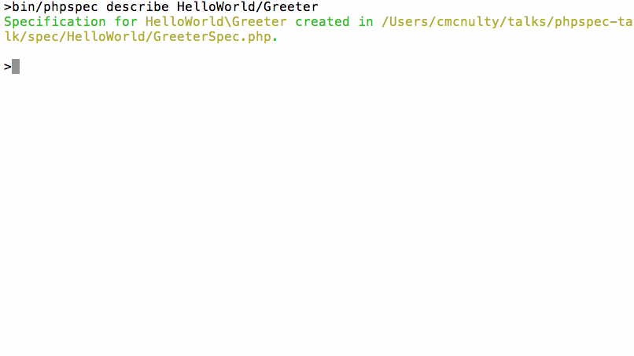
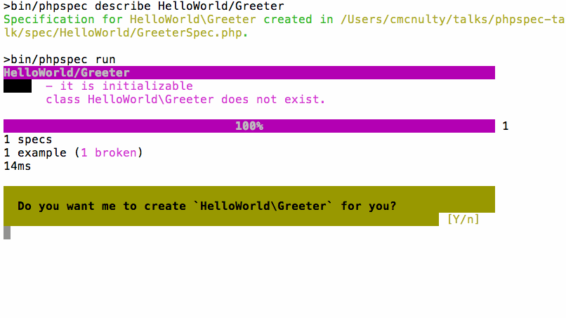
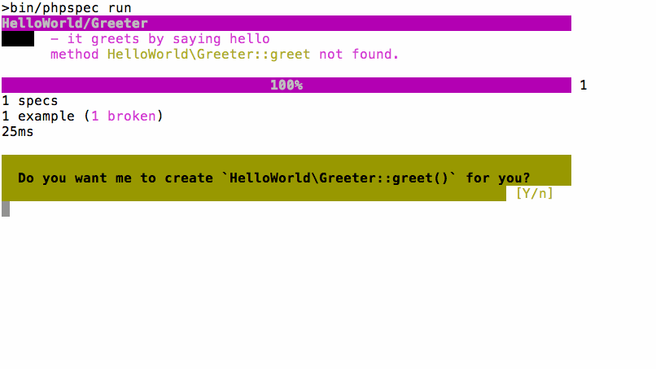
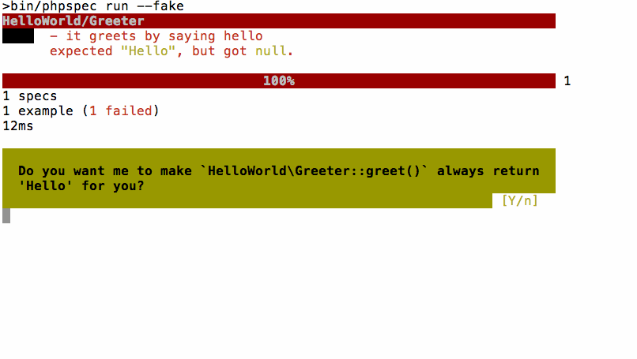
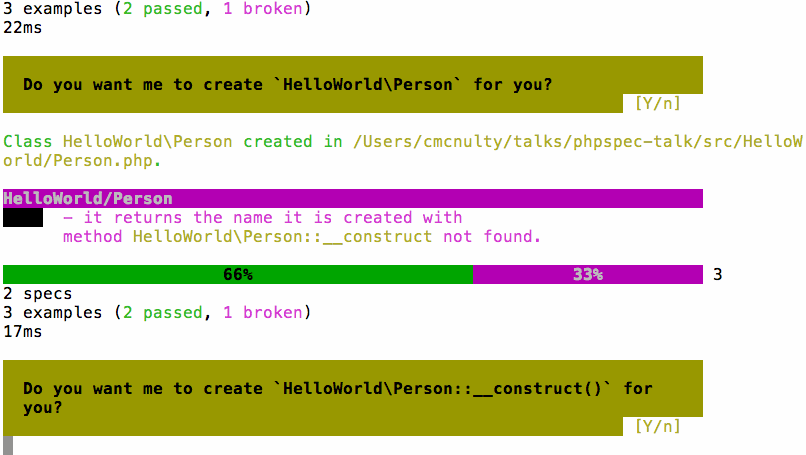
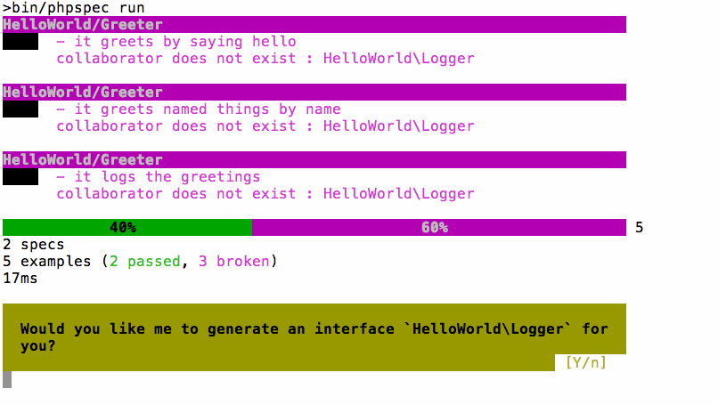
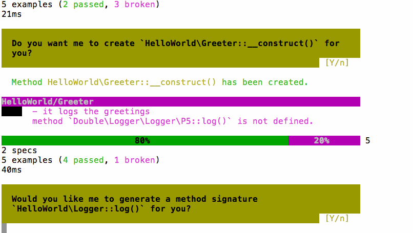

# Driving Development with PhpSpec
## with Ciaran McNulty
### PHPLondon November 2014

---

# My experiences

*  Unit testing since 2004
*  Test Driven Development since 2005(ish)
*  Behaviour Driven Development since 2012

---

#[fit] TDD vs BDD

#[fit] \(or are they the same?\)

---

> BDD is a second-generation, outside-in, pull-based, multiple-stakeholder…
-- Dan North

---

> …multiple-scale, high-automation, agile methodology.
-- Dan North

^ Does make perfect sense if you unpack it

---

> BDD is the art of using examples in conversation to illustrate behaviour
-- Liz Keogh

---

# Test Driven Development

* Before you write your code, **write a test that validates how it should behave**
* After you have written the code, **see if it passes the test**


---

# Behaviour Driven Development

* Before you write your code, **describe how it should behave using examples**
* Then, **Implement the behaviour you have described**


^ TDD focuses on tests and gets design benefits as a bonus

^ BDD focuses on descripiveness and gets testing as a bonus

----


^ Explain axes

----


^ Angled towards testing, rather than trying to be descriptive

^ Can be used for all scales

^ Consequently isn't optimised for any scale

^ Multi-tool

----


----


^ Specialisation = optimisation

^ Can assume you want to test one class at a time

---

# SpecBDD with PhpSpec
## Describing individual classes

---

# History


## 1.0 - Inspired by RSpec

* Pádraic Brady and Travis Swicegood

---

# History

## 2.0beta - Inspired by 1.0

* Marcello Duarte and Konstantin Kudryashov (Everzet)
* Ground-up rewrite
* No BC in specs

---

# History

## 2.0 stable - The boring bits

* Me
* Christophe Coevoet
* Jakub Zalas
* Richard Miller
* Gildas Quéméner
* Luis Cordova + MANY MORE

---

# Installation via Composer

```json
{
    "require-dev": {
        "phpspec/phpspec": "~2.1-RC1"
    },
    "config": {
        "bin-dir": "bin"
    },
    "autoload": {"psr-0": {"": "src"}}
}
```

---
 


---

## A requirement:
# We need something that says hello to people

---

# Describing object behaviour 

* We **describe an object** using a **Specification**
* A specification is made up of **Examples** illustrating different scenarios

Usage:
`phpspec describe [Class]`

---


^ Talk about forward slashes + escaping

---

#[fit] /spec/PhpLondon/HelloWorld/GreeterSpec.php

```php

namespace spec\PhpLondon\HelloWorld;

use PhpSpec\ObjectBehavior;
use Prophecy\Argument;

class GreeterSpec extends ObjectBehavior
{
    function it_is_initializable()
    {
        $this->shouldHaveType('PhpLondon\HelloWorld\Greeter');
    }
}

```

---

# Verifying object behaviour 

* Compare the real objects' behaviours with the examples

Usage:
`phpspec run`

---



---



---

#[fit] /src/PhpLondon/HelloWorld/Greeter.php

```php

namespace PhpLondon\HelloWorld;

class Greeter
{
}
```

^ Template is customisable
^ @author for narciccists
^ Nothing here yet - describe its behaviour using examples

---

## An example for Greeter:
# When this greets, it should return "Hello"

^ Conversation with who?
^ A Pair, a colleague, yourself in 2 weeks

---

#[fit] /spec/PhpLondon/HelloWorld/GreeterSpec.php

```php

class GreeterSpec extends ObjectBehavior
{
    function it_greets_by_saying_hello()
    {
        $this->greet()->shouldReturn('Hello');
    }
}

```

^ $this is the SUS
^ tries to read naturally
^ NOT CODE
^ Weird formatting deliberate decision

---


---




---

#[fit] /src/PhpLondon/HelloWorld/Greeter.php

```php

class Greeter
{
    public function greet()
    {
        // TODO: write logic here
    }
}
```

---

# [fit]So now I write some code?

^ Not if you don't want to

---

# Fake it till you make it

* Do the simplest thing that works

* Only add complexity later when more examples drive it

`phpspec run --fake`

^ This is an option because...

---


---



---

#[fit] /src/PhpLondon/HelloWorld/Greeter.php

```php

class Greeter
{
    public function greet()
    {
        return 'Hello';
    }
}
```

^ Got this far with no code

---

# Describing values
## Matchers

^ The thing we're talking about is a return value
^ Describing it with a matcher, shouldReturn

---

# Describing values - Equality

```php
$this->greet()->shouldReturn('Hello');

$this->sum(3,3)->shouldEqual(6);

$user = $this->findById(1234);
$user->shouldBe($expectedUser);

$this->numberList()
     ->shouldBeLike(new ArrayObject([1,2,3]));
```
---

# Describing values - Type

```php

$this->address()->shouldHaveType('EmailAddress');

$this->getTime()->shouldReturnAnInstanceOf('DateTime');

$user = $this->findById(1234);
$user->shouldBeAnInstanceOf('User');

$this->shouldImplement('Countable');
```

---

# Describing values - Strings

```php
$this->getStory()->shouldStartWith('A long time ago');
$this->getStory()->shouldEndWith('happily ever after');

$this->getSlug()->shouldMatch('/^[0-9a-z]+$/');
```

---

# Describing values - Arrays

```php
$this->getNames()->shouldContain('Tom');

$this->getNames()->shouldHaveKey(0);

$this->getNames()->shouldHaveCount(1);
```

---

# Describing values - object state

```php
// calls isAdmin()
$this->getUser()->shouldBeAdmin();

// calls hasLoggedInUser()
$this->shouldHaveLoggedInUser();
```

---

# Describing custom values

```php

function it_gets_json_with_user_details()
{
    $this->getResponseData()->shouldHaveJsonKey('username');
}

public function getMatchers()
{
    return [
        'haveJsonKey' => function ($subject, $key) {
            return array_key_exists($key, json_decode($subject));
        }
    ];
}

```

---

## Another example for Greeter:
# When this greets Bob, it should return "Hello, Bob"

^ elicit examples through conversation
^ When might it not just say hello?

---

## Wait, what is Bob?
# Bob is a Person
## What is a Person?

---


---

## An example for a Person:
# When you ask a person named "Alice" for their name, they return "Alice"

---

# [fit] /spec/PhpLondon/HelloWorld/PersonSpec.php

```php
class PersonSpec extends ObjectBehavior
{
    function it_returns_the_name_it_is_created_with()
    {
        $this->beConstructedWith('Alice');

        $this->getName()->shouldReturn('Alice');
    }
}
```

---


---


---



---


---

# [fit] /src/PhpLondon/HelloWorld/Person.php

```php
class Person
{
    public function __construct($argument1)
    {
        // TODO: write logic here
    }

    public function getName()
    {
        // TODO: write logic here
    }
}
```

---

# [fit] So now I write some code!

---

# [fit] /src/PhpLondon/HelloWorld/Person.php

```php
class Person
{
    private $name;

    public function __construct($name)
    {
        $this->name = $name;
    }

    public function getName()
    {
        return $this->name;
    }
}
```

---


---

## Another example for a Person:
# When a person named "Alice" changes their name to "Bob", when you ask their name they return "Bob"

^ Conversation, Questions

---

# [fit] /spec/PhpLondon/HelloWorld/PersonSpec.php

```php
class PersonSpec extends ObjectBehavior
{
    function it_returns_the_name_it_is_created_with()
    {
        $this->beConstructedWith('Alice');
        $this->getName()->shouldReturn('Alice');
    }
}
```

^ Existing example

---

# [fit] /spec/PhpLondon/HelloWorld/PersonSpec.php

```php
class PersonSpec extends ObjectBehavior
{
    function let()
    {
        $this->beConstructedWith('Alice');
    }

    function it_returns_the_name_it_is_created_with()
    {
        $this->getName()->shouldReturn('Alice');
    }
}
```

^ refactor

---

# [fit] /spec/PhpLondon/HelloWorld/PersonSpec.php

```php
class PersonSpec extends ObjectBehavior
{
    function let()
    {
        $this->beConstructedWith('Alice');
    }

    // …

    function it_returns_its_new_name_when_the_name_has_been_changed()
    {
        $this->changeNameTo('Bob');

        $this->getName()->shouldReturn('Bob');
    }
}
```

^ Other example's still there

---


---


---

# [fit] /src/PhpLondon/HelloWorld/Person.php

```php
class Person
{
    private $name;

    // …

    public function changeNameTo($argument1)
    {
        // TODO: write logic here
    }
}
```

---

# [fit] /src/PhpLondon/HelloWorld/Person.php

```php
class Person
{
    private $name;

    // …

    public function changeNameTo($name)
    {
        $this->name = $name;
    }
}
```

---


---

## Another example for Greeter:
# When this greets Bob, it should return "Hello, Bob"

^ We're starting to talk about the collaboration between objects

---

# Describing collaboration - Stubs

**Stubs** are used to describe how we interact with objects we **query**

* Maybe it is hard to get the real collaborator to return the value we want
* Maybe using the real collaborator is expensive

---

#[fit] /spec/PhpLondon/HelloWorld/GreeterSpec.php

```php
class GreeterSpec extends ObjectBehavior
{
    //…

    function it_greets_people_by_name(Person $bob)
    {
        $bob->getName()->willReturn('Bob');

        $this->greet($bob)->shouldReturn('Hello, Bob');
    }
}
```

---


^ Straightforward failure condition

---

#[fit] /src/PhpLondon/HelloWorld/Greeter.php

```php

class Greeter
{
    public function greet()
    {
        return 'Hello';
    }
}
```

---

#[fit] /src/PhpLondon/HelloWorld/Greeter.php

```php

class Greeter
{
    public function greet()
    {
        $greeting = 'Hello';

        return $greeting;
    }
}
```

---

#[fit] /src/PhpLondon/HelloWorld/Greeter.php

```php

class Greeter
{
    public function greet(Person $person = null)
    {
        $greeting = 'Hello';

        if ($person) {
            $greeting .= ', ' . $person->getName();
        }

        return $greeting;
    }
}
```

---


^ Soothing green

---

## Final example for Greeter:
# When it greets Bob, the message "Hello Bob" should be logged

---

## What's a log?
# Let's not worry yet

---

#[fit] /src/PhpLondon/HelloWorld/Logger.php

```php
interface Logger
{
    public function log($message);
}
```

---

# Describing collaboration - Mocks and Spies

**Mocks** or **Spies** are used to describe how we interact with objects we **command**

* Maybe the real command is has side effects
* Maybe using the real collaborator is expensive


---

#[fit] /spec/PhpLondon/HelloWorld/GreeterSpec.php

```php
class GreeterSpec extends ObjectBehavior
{
    //…

    function it_greets_people_by_name(Person $bob)
    {
        $bob->getName()->willReturn('Bob');
        $this->greet($bob)->shouldReturn('Hello, Bob');
    }
}

```

---

#[fit] /spec/PhpLondon/HelloWorld/GreeterSpec.php

```php
class GreeterSpec extends ObjectBehavior
{
    function let(Person $bob)
    {
        $bob->getName()->willReturn('Bob');
    }

    //…

    function it_greets_people_by_name(Person $bob)
    {
        $this->greet($bob)->shouldReturn('Hello, Bob');
    }
}

```

^ Explain how Bob is shared

---

#[fit] /spec/PhpLondon/HelloWorld/GreeterSpec.php

```php
class GreeterSpec extends ObjectBehavior
{
    function let(Person $bob, Logger $logger)
    {
        $this->beConstructedWith($logger);
        $bob->getName()->willReturn('Bob');
    }

    //…

    function it_logs_the_greetings(Person $bob, Logger $logger)
    {
        $this->greet($bob);
        $logger->log('Hello, Bob')->shouldHaveBeenCalled();
    }
}

```

^ Important to remember Logger is an interface here
^ shouldHaveBeenCalled indicates a SPY
^

---



---



---

#[fit]/src/PhpLondon/HelloWorld/Greeter.php

```php
class Greeter
{
    public function __construct($argument1)
    {
        // TODO: write logic here
    }

    public function greet(Person $person = null)
    {
        $greeting = 'Hello';
        if ($person) { $greeting .= ', ' . $person->getName(); }

        return $greeting;
    }
}
```


---

#[fit]/src/PhpLondon/HelloWorld/Greeter.php

```php
class Greeter
{
    private $logger;

    public function __construct(Logger $logger)
    {
        $this->logger = $logger;
    }

    public function greet(Person $person = null)
    {
        $greeting = 'Hello';
        if ($person) { $greeting .= ', ' . $person->getName(); }

        $this->logger->log($greeting);

        return $greeting;
    }
}
```

---


---

# What have we built?

---

# The domain model


---

# Specs as documentation


---

# PhpSpec

* Focuses on being **descriptive**
* Makes common dev activities **easier or automated**
* **Drives** your design

---

# 2.1 release - soon!

* Rerun after failure
* `--fake` option
* Named constructors: User::named('Bob')
* PSR-4 support (+ other autoloaders)
* + lots of small improvements

---

# Me

* **Senior Trainer** at  Inviqa / Sensio Labs UK / Session Digital
* Contributor to **PhpSpec**

* **@ciaranmcnulty**
* https://github.com/ciaranmcnulty/**phplondon-phpspec-talk**

---

# Questions?
